# Palantir Ontology — Building the Digital Twin of the Enterprise

**A Forward-Deployed Engineer's field guide to semantic data modeling with Foundry's Ontology Manager**

[](https://www.palantir.com/platforms/foundry/)
[]()
[]()
[](LICENSE)

> Part 2 of a 4-part series. 📦 Part 1 — [Data Pipelines](https://github.com/manuelbomi/palantir-foundry-data-pipelines) → 🧠 **Part 2 — Ontology** (this repo) → 🖥️ Part 3 — [Workshop Apps](https://github.com/manuelbomi/palantir-foundry-workshop-apps) → 🧭 Part 4 — [The FDE Playbook](https://github.com/manuelbomi/palantir-foundry-fde-playbook) (capstone)

---

## Table of Contents

1. [The Problem: A Table Is Not a Business Concept](#the-problem-a-table-is-not-a-business-concept)
2. [What an Ontology Actually Is](#what-an-ontology-actually-is)
3. [Why This Matters Far Beyond This Example](#why-this-matters-far-beyond-this-example)
4. [Walkthrough: Modeling the Order Object](#walkthrough-modeling-the-order-object)
5. [Design Decisions an FDE Has to Defend](#design-decisions-an-fde-has-to-defend)
6. [The Ontology as a Compounding Asset](#the-ontology-as-a-compounding-asset)
7. [Why Palantir's Approach to Semantic Modeling Is Different](#why-palantirs-approach-to-semantic-modeling-is-different)
8. [How to Reuse This Pattern in Other Domains](#how-to-reuse-this-pattern-in-other-domains)
9. [Repo Contents](#repo-contents)
10. [Related Repositories](#related-repositories)

---

## The Problem: A Table Is Not a Business Concept

At the end of [Part 1](https://github.com/manuelbomi/palantir-foundry-data-pipelines), we have `all_orders` — a clean, unified, governed Foundry **dataset**. That solves the data integration problem. It does not, by itself, solve the *business* problem, because a dataset is still just rows and columns. A fulfillment manager doesn't think in rows and columns — they think in **Orders**: things that have a status, an assignee, a due date, and a customer, and that can be *acted on* ("reassign this order," "mark this closed").

This is the gap the **Ontology** is built to close: turning a dataset into a semantic, queryable, actionable representation of a real business concept.

## What an Ontology Actually Is

Foundry's Ontology is described as a relational **"digital twin"** of the business, made up of **Object Types** (e.g., `Order`, `Customer`, `Facility`, `Patient`, `Shipment`) — each backed by one or more real datasets, each with a defined primary key, a human-readable title, typed properties, and (eventually) **Actions** that let users or systems safely modify the underlying data through a governed interface rather than direct table edits.

In this repo, we define a single Object Type — **Order** — backed by the `all_orders` dataset from Part 1:

```
all_orders (dataset)
      │
      ▼
 Order (Object Type)
   ├─ Primary key:  Order Id
   ├─ Title:        Item Name
   └─ Properties:   Customer Name, Status, Assignee, Days Until Due, Order Due Date, ...
```

## Why This Matters Far Beyond This Example

Every domain has its own version of "a row that is actually a business concept":

- **Healthcare:** a row in a claims table becomes a `Patient Encounter` Object with a status, a provider, and an authorization state
- **Manufacturing:** a row in a sensor-log table becomes an `Asset` Object with a health score, a maintenance schedule, and an owner
- **Financial services:** a row in a transactions table becomes a `Case` Object in a fraud or AML workflow, with an assignee and a disposition
- **Defense & logistics:** a row in a manifest becomes a `Shipment` Object with a status, a custody chain, and an ETA
- **Government:** a row in a benefits database becomes a `Case` Object with an applicant, a caseworker, and an adjudication status

The pattern an FDE repeats across every one of these engagements is identical to what's in this repo: **take a governed dataset, decide what real-world "thing" each row represents, define its identity (primary key) and its display name (title), and expose its properties in a way the rest of the platform — apps, actions, AI agents — can build on.**

## Walkthrough: Modeling the Order Object

### 1. Open Ontology Manager

Ontology Manager is Foundry's application for defining and governing Object Types — it's where the "digital twin" is actually assembled.

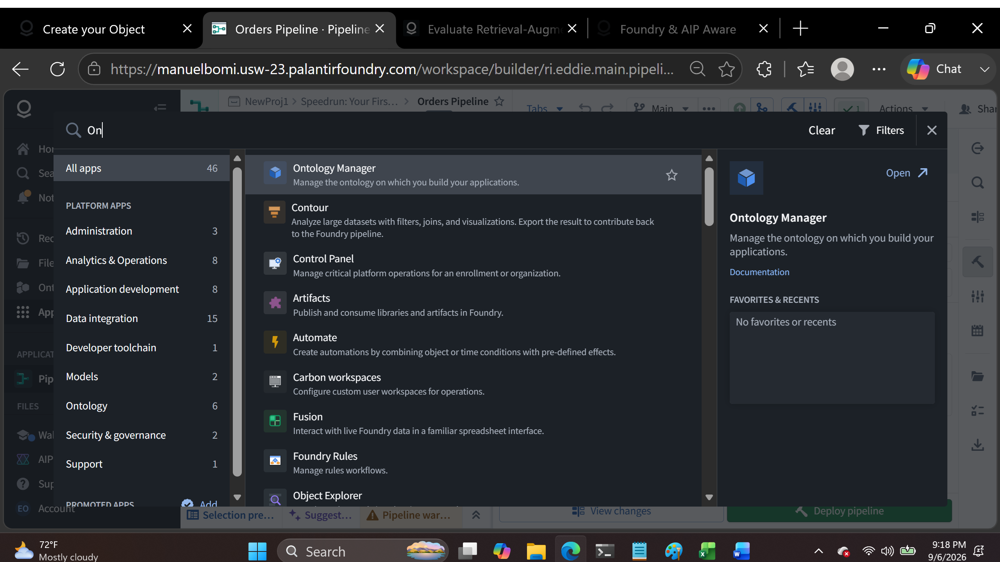
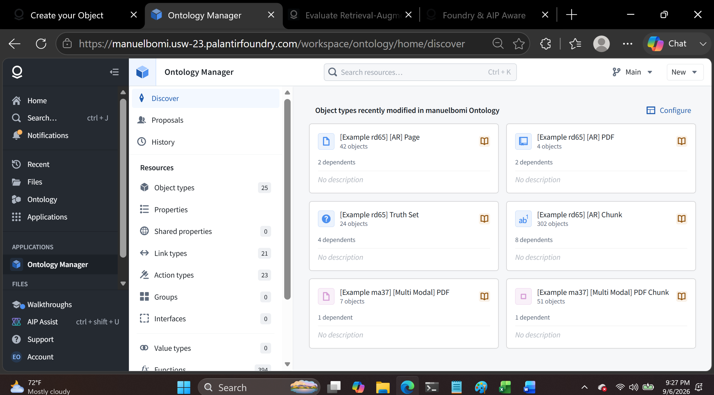

### 2. Start a new Object Type

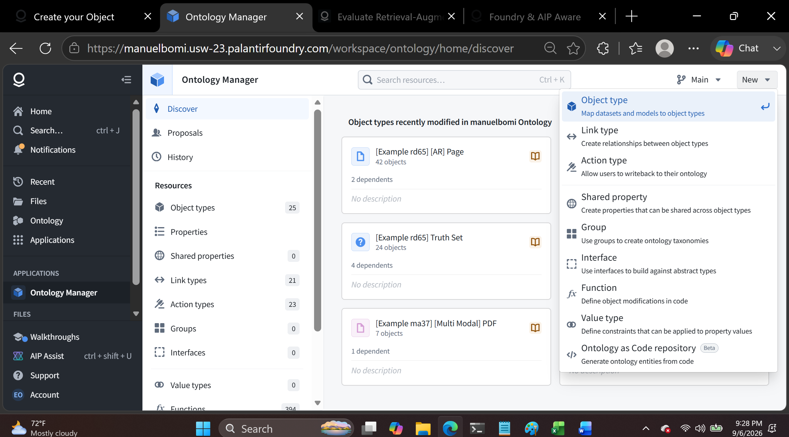
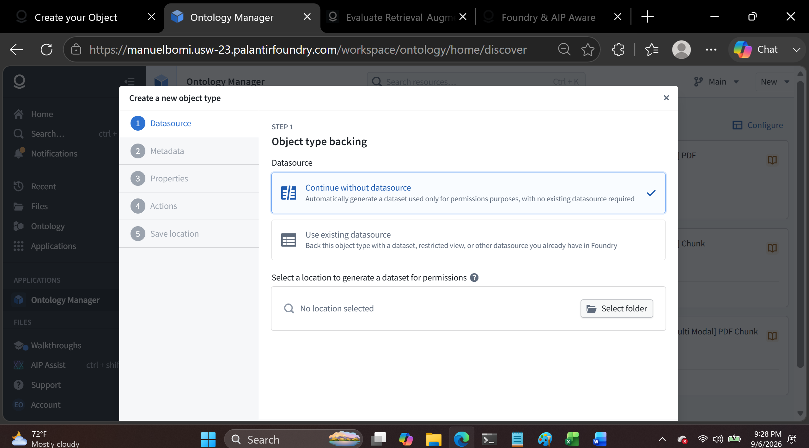

> Note: in a real customer environment, this step often surfaces org-specific governance — some organizations restrict edits to the production Ontology and require an **Ontology Branch** and a review/merge process (analogous to a Git branch and pull request) before a new Object Type reaches everyone. Part of an FDE's job on day one of an engagement is understanding *which* governance model a given customer runs, not assuming it's wide open.

### 3. Back the Object Type with the pipeline output from Part 1

The Object Type is defined against an **existing datasource** — the `all_orders` dataset deployed in Part 1 — rather than requiring new ingestion. This is the direct hand-off point between the two repos: the pipeline's output *is* the Ontology's input.

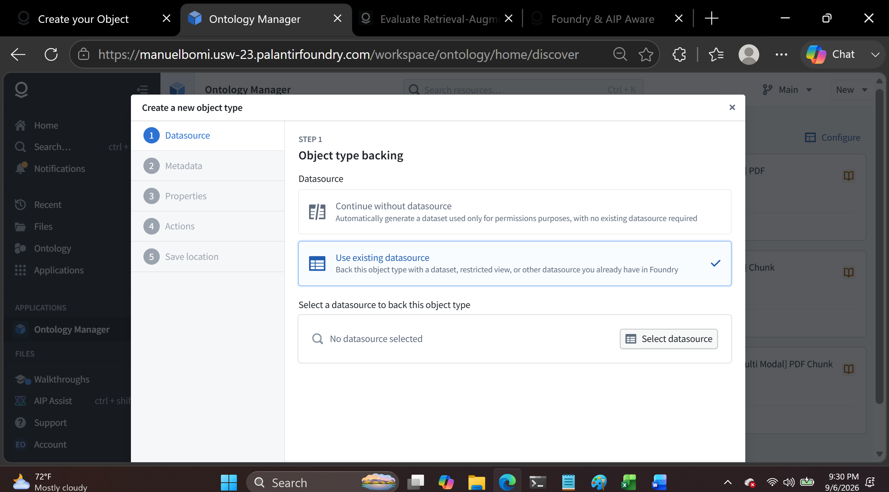
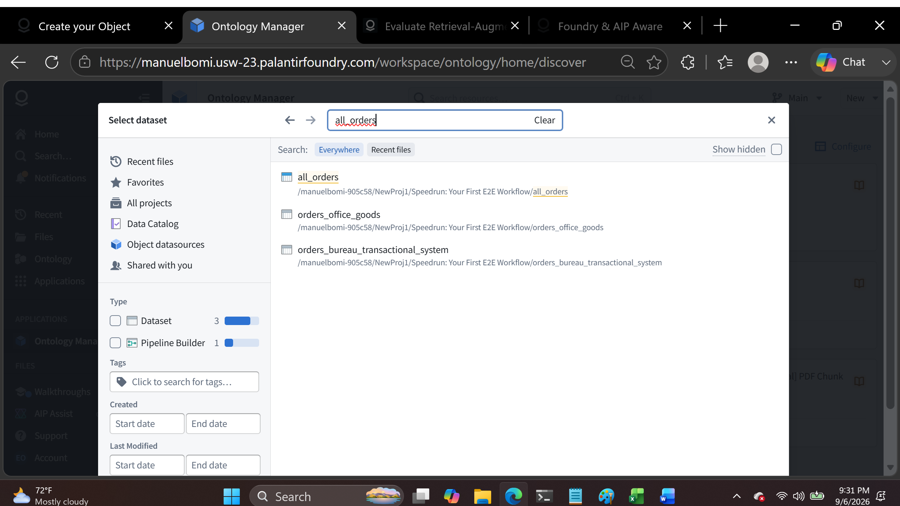
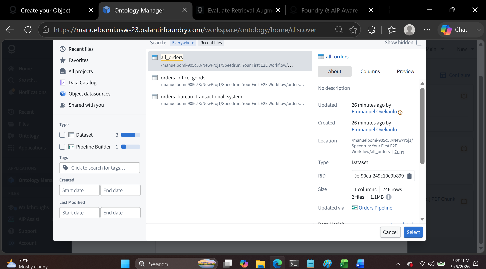
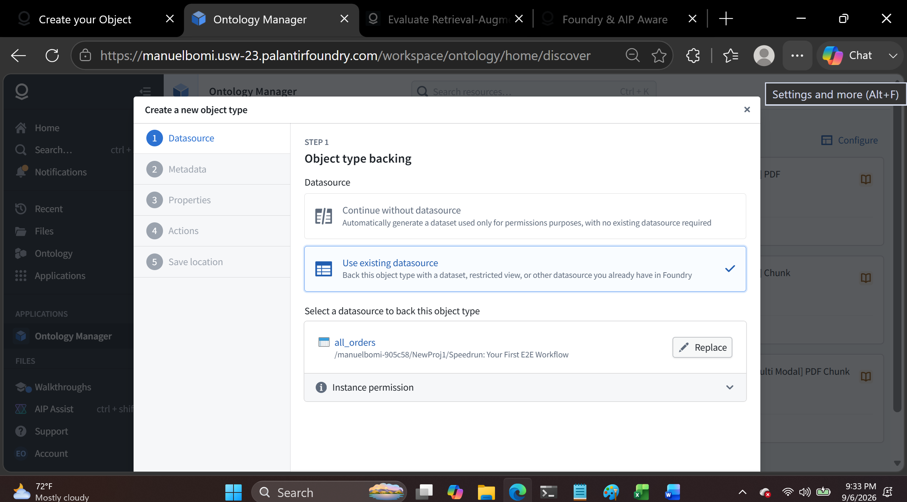

### 4. Configure identity and metadata

This is the most consequential step in the whole exercise. Two choices define how every other application in Foundry will "see" this Object forever:

- **Primary key** → `Order Id`: the unique identifier every downstream reference resolves against
- **Title property** → `Item Name`: the human-readable label shown across every table, search box, and card in the platform

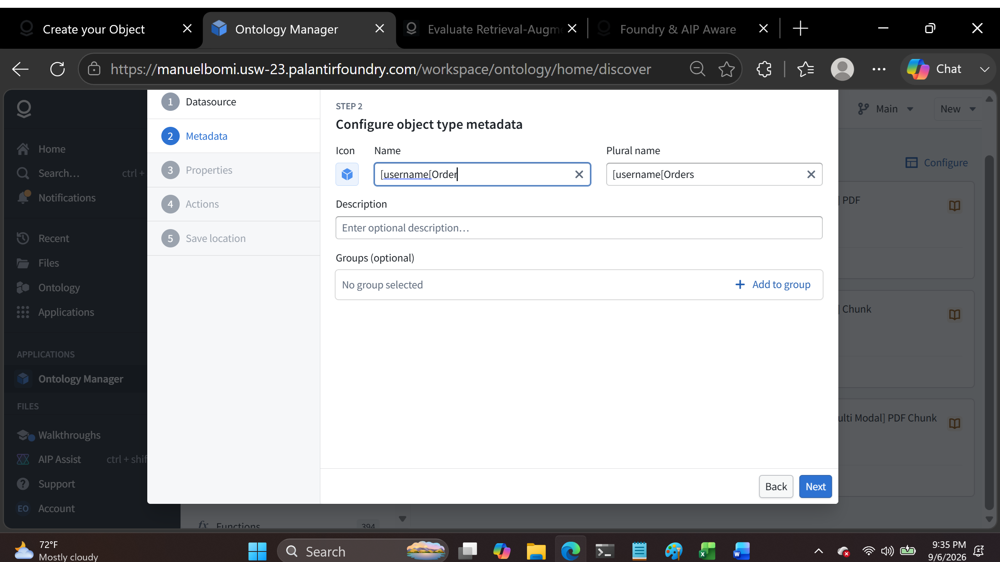
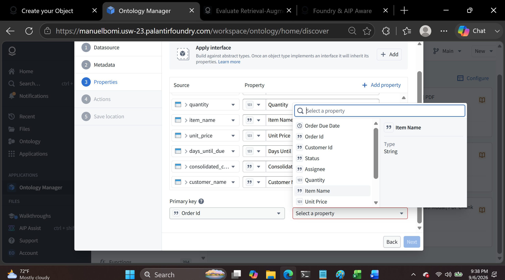

All columns from `all_orders` are auto-mapped to Object properties. For this build we keep the full set — but on a real engagement, this is the moment to prune anything that's an internal artifact of the source system rather than a genuine business property.

Actions (the governed, auditable operations users will eventually be allowed to perform on an Order — like reassigning it) are configured later, once the operational app in Part 3 makes clear which actions the business actually needs. Modeling an Action before you know its real trigger just produces an Action nobody uses.

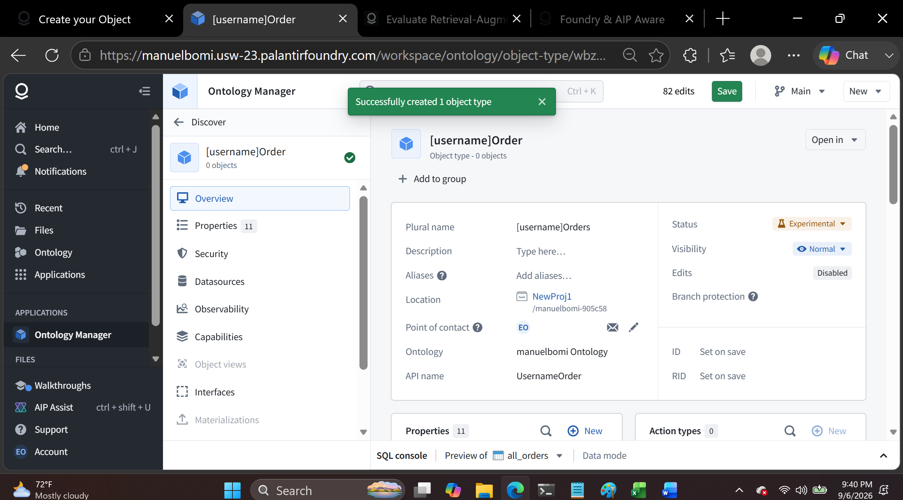

### 5. Save to the Ontology and let indexing complete

Defining the Object Type isn't enough — it has to be saved to the Ontology, which triggers **indexing**: Foundry materializing every individual `Order` object from the rows of `all_orders`. Indexing is asynchronous; on a large backing dataset in production, this can take real time, and nothing downstream (a Workshop app, an Action, an AIP agent) can reference the new Objects until it completes.

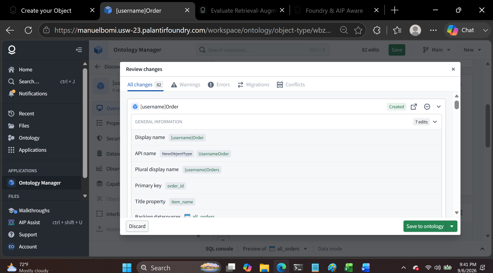
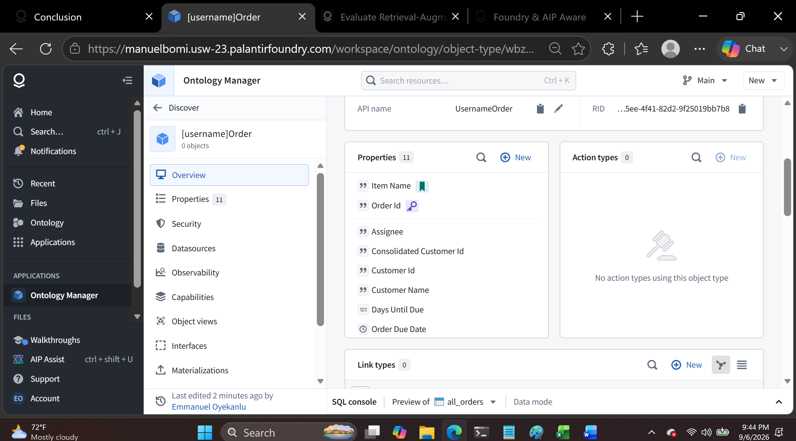

At this point, `Order` is a first-class, queryable Object in the Ontology — ready to be surfaced in a live operational application in [Part 3](https://github.com/manuelbomi/palantir-foundry-workshop-apps).

## Design Decisions an FDE Has to Defend

- **Why `Order Id` as primary key and not, say, `Customer Id`?** Primary key selection has to reflect the actual grain of the business concept. An Order object needs an identifier unique *per order* — using a non-unique column as the key silently collapses distinct real-world orders into one Object, corrupting every downstream count and action.
- **Why `Item Name` as the title instead of `Order Id`?** The title is what a human sees everywhere in the platform — search results, table rows, cards. A UUID-like order ID is correct as a key but useless as a label; the title should be whatever a person would actually say out loud to identify the thing.
- **Why not define Actions immediately?** Actions encode *business processes* (who's allowed to reassign an order, under what conditions), not just data mutations. Defining them speculatively, before the operational app surfaces which actions the fulfillment team actually needs, tends to produce Actions that don't match how people really work — better to model the Object first, observe the app's requirements, then add Actions deliberately (covered in Part 3 / the capstone).
- **Why one Object Type and not several (e.g., splitting Order and OrderLineItem)?** For this dataset's grain — one row per order — a single Object Type is the right level of normalization. In a richer schema (e.g., orders with nested line items), an FDE would model a linked `Order` → `OrderLineItem` relationship instead of overloading one Object Type with repeating groups.

## The Ontology as a Compounding Asset

This is the property of Ontology-based modeling that most distinguishes Foundry from a typical BI semantic layer: **once `Order` exists as an Object Type, every future use case gets to reuse it for free.** A new dashboard, a new AIP agent, a new automated alert, or a completely different team's application can all reference the same `Order` Object — with the same governed definition of what a "customer name" or "status" means — instead of every team re-deriving their own version of "what is an order" from raw tables. The Ontology is explicitly designed to compound in value with each additional use case built on top of it, rather than being consumed and discarded like a one-off report.

## Why Palantir's Approach to Semantic Modeling Is Different

Most platforms give you a choice: a governed data warehouse with rigid schemas, or a flexible BI layer with no shared governance. The Ontology is Palantir's answer to needing both simultaneously:

- **One semantic layer, many consumers.** The same `Order` Object backs Workshop apps, Actions, write-back workflows, and AIP agents — there's no separate "reporting layer" that drifts out of sync with the "operational layer."
- **Objects are actionable, not just readable.** Because Actions are modeled as part of the Ontology (not bolted on in application code), a change made through an app is governed, audited, and consistent no matter which app made it.
- **It's how AI gets grounded in real business logic.** Palantir's AIP layer reasons and acts over Ontology Objects — an AI agent asked to "reassign overdue orders" is operating on the same governed `Order` Object defined here, with the same permissions and audit trail as a human user, rather than hallucinating against raw, ungoverned tables.

## How to Reuse This Pattern in Other Domains

1. **Find the noun, not the table.** Ask "what real-world thing does one row represent?" — an Order, a Patient, an Asset, a Case, a Shipment — before touching Ontology Manager.
2. **Choose a primary key at the correct grain** for that noun — not just any unique-looking column.
3. **Choose a title that a human would say out loud**, not an internal identifier.
4. **Resist defining Actions on day one.** Model the Object, let a real application surface real user needs, then formalize Actions around actual workflows.
5. **Treat the Object Type as reusable infrastructure**, not a one-off artifact for a single dashboard — design it so the next team's use case can build on it without redefining what an "Order" (or "Patient," or "Shipment") means.

## Repo Contents

```
├── images/     # 13 annotated screenshots of the Ontology build, in build order
└── README.md
```

> This repo has no standalone datasets — it operates on the `all_orders` dataset produced in [Part 1](https://github.com/manuelbomi/palantir-foundry-data-pipelines).

## Related Repositories

| Part | Repo | Focus |
|---|---|---|
| 1 | [palantir-foundry-data-pipelines](https://github.com/manuelbomi/palantir-foundry-data-pipelines) | Data integration with Pipeline Builder |
| 2 | **palantir-foundry-ontology** (this repo) | Modeling the unified dataset as a live Ontology Object |
| 3 | [palantir-foundry-workshop-apps](https://github.com/manuelbomi/palantir-foundry-workshop-apps) | Turning the Ontology into an operational application |
| 4 | [palantir-foundry-fde-playbook](https://github.com/manuelbomi/palantir-foundry-fde-playbook) | The end-to-end case study and generalized FDE playbook |

---

*Author: [manuelbomi](https://github.com/manuelbomi) — built while working through Palantir's official Foundry tutorial content, reframed around the kinds of problems a Forward-Deployed Engineer solves in the field.*
